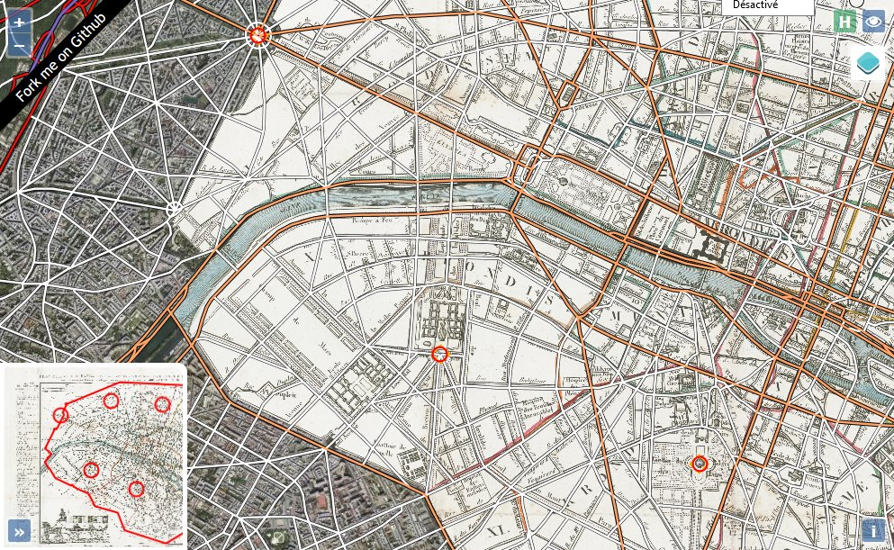

# Map-georeferencer
An Proof of concept to georeference maps with Openlayers (ol).

## Description

[View it online](http://viglino.github.io/Map-georeferencer/)

You can download an image or give a valid link to get it online.
The image will appear on the left side and on the right side is the reference map. 
Find same places on both maps.  
A minimum of two control points are required to calculate the geographical position of the map. 
The more control points that are added, the more precise the georeference is.

The transformation model is an [Helmert](https://en.wikipedia.org/wiki/Helmert_transformation) or an affine  transform.

The image map can appear as an overlay on the reference maps. 
Side-by-side view is available as well, to compare any two maps next to each other. 

You can crop the image by defining a crop polygon directly on the image.

You can get parameters via the tranformation button on the bottom of the screen. 
This transformation can be used with an [ol.source.geoimagesource](https://github.com/Viglino/ol3-ext/blob/gh-pages/layer/geoimagesource.js) in an ol map.

## Dependencies

Map-georeferencer use [ol](https://github.com/openlayers/ol3), [jQuery](https://jquery.com/) and [ol-ext](https://github.com/Viglino/ol-ext).

## Licence

Map-georeferencer is licenced under the French Opensource BSD like CeCILL-B FREE SOFTWARE LICENSE.  
 (c) 2016 - Jean-Marc Viglino

Some resources (mapping services and API) used in this sofware may have a specific license.  
You must check before use.

Full text license in English: (http://www.cecill.info/licences/Licence_CeCILL-B_V1-en.txt)  
Full text license in French: (http://www.cecill.info/licences/Licence_CeCILL-C_V1-fr.txt)
